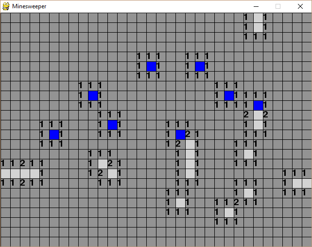
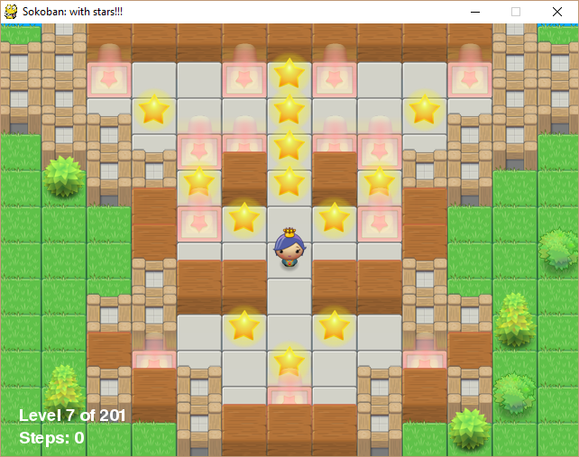
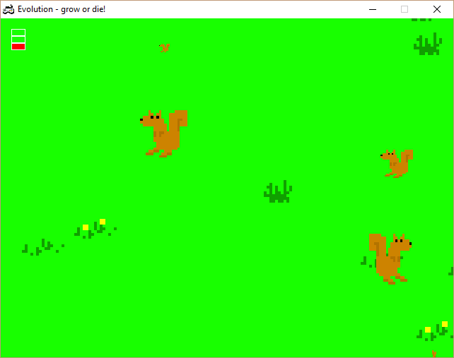
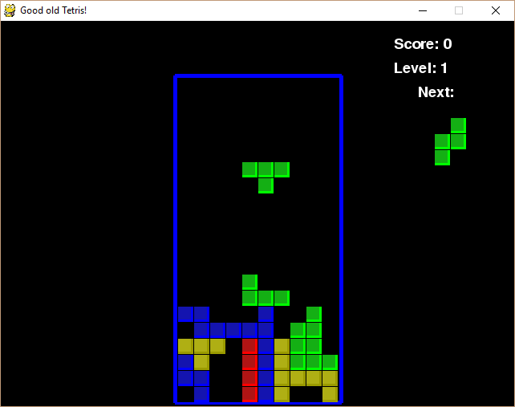
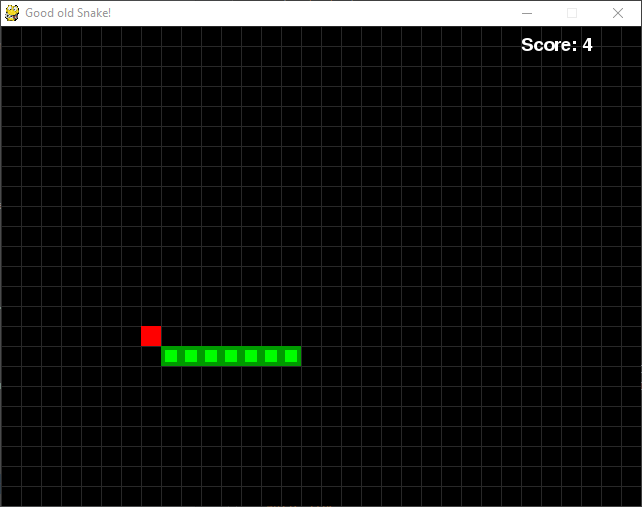
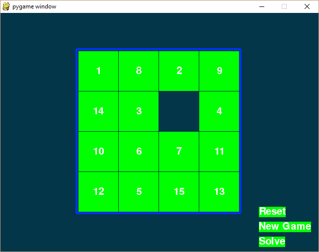
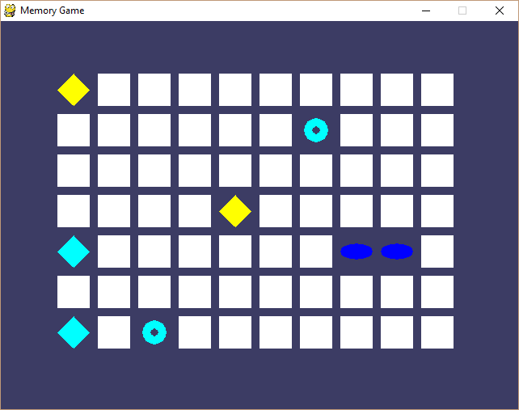

# Hello Pygame
spent the weekend learning python and pygame  
by working through the book [making games with python & pygame](https://inventwithpython.com/pygame/)  

after finishing the book I continued reading additional sources on pythons oop constructs, generators, etc  
then I went and created my own [minesweeper clone](minesweeper/)  

if you are an experienced developer and just looking for a quick python overview have a look at  
[learn x in y minutes](https://learnxinyminutes.com/docs/python/)  

## Mine Sweeper
- OOP Class Design
- using Bit Masking to encode cell states
- nice flood fill algorithm

## Other Games

</img> </img> </img>

</img> </img> </img>

## Credits
- Albert Sweigart for providing the excellent free ebook [making games with python & pygame](https://inventwithpython.com/pygame/)
- Daniel Cook for providing high quality [free art](http://www.lostgarden.com/2007/05/dancs-miraculously-flexible-game.html)

## Disclaimer
Code is published under the [MIT License](LICENSE.md)  
Art Assets retain their respective Licenses most are CC-BY-SA